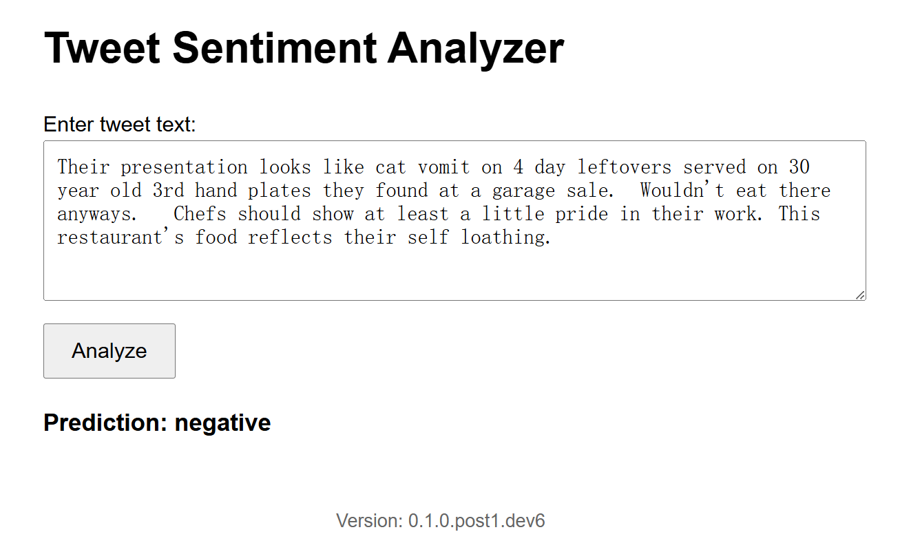
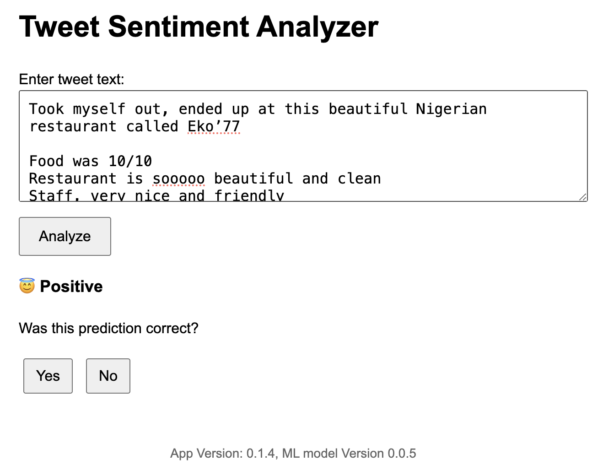
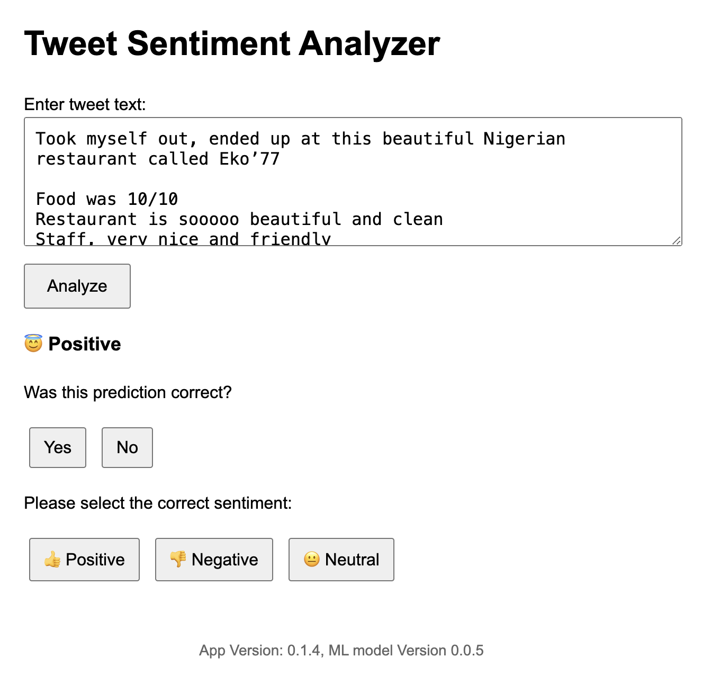

# Project Overview

This repository contains a modular tweet sentiment analysis system, organized into six individual repositories under the `remla25-team1` organization:

* **app**: Front-end application and API gateway responsible for serving pages and forwarding model inference requests.
* **model-service**: Microservice for handling sentiment classification requests, interfacing with the preprocessing library and the trained model.
* **model-training**: Training pipeline to build and export sentiment classification models.
* **lib-ml**: Shared preprocessing library for text cleaning, tokenization, and feature extraction.
* **lib-version**: Versioning library to manage and expose the current application version.
* **operation**: Deployment and orchestration artifacts (e.g., Docker, Kubernetes manifests) for the end-to-end system.

Each component can be developed, tested, and deployed independently, yet they form a cohesive machine learning-powered web service.

## Install & Run

Make sure you have installed:
- **Docker** and **Docker Compose** installed: [Install Docker & Docker Compose](https://docs.docker.com/compose/install/)
- **Vagrant**
- **Ansible**
- **Kubectl**

## Clone the Repository

Clone the **operation** repository from GitHub (e.g., using SSH):

   ```bash
   git clone git@github.com:remla25-team1/operation.git
   cd operation
   ```

<!-- ### 2. Start the Services
From the root of the **operation** repository, build and start all services using Docker Compose:

   ```bash
   docker compose up --build
   # or, if using the older syntax:
   docker-compose up --build
   ```

Once the containers are running, open your browser and go to [http://localhost:8080](http://localhost:8080) to access the application.


### 3. Stop and Clean Up

   ```bash
   docker compose down
   # or
   docker-compose down
   ``` -->

## Running Kubernetes Cluster
Navigate into ```operation``` dir and run:

```bash
vagrant up

# So that the cluster_network and ctrl_ip are not hardcoded
ansible-playbook -u vagrant -i 192.168.56.100, playbooks/finalization.yaml --extra-vars "cluster_network=192.168.56 ctrl_ip=192.168.56.100"
```

To tear down the cluster run:
```bash
vagrant destroy

docker network ls # here you can check if the network is still live and remove it 
```


All VMs mount the same shared VirtualBox folder as /mnt/shared into the VM. You can check this yourself. Here is a little proof:
```bash
vagrant@k8s-ctrl:~$ cd ..
vagrant@k8s-ctrl:/home$ cd ..
vagrant@k8s-ctrl:/$ ls
bin                boot   dev  home  lib.usr-is-merged  media  opt   root  sbin                snap  swap.img  tmp  vagrant         var
bin.usr-is-merged  cdrom  etc  lib   lost+found         mnt    proc  run   sbin.usr-is-merged  srv   sys       usr  vagrant_shared
vagrant@k8s-ctrl:/$ cd mnt
vagrant@k8s-ctrl:/mnt$ ls
shared
vagrant@k8s-ctrl:/mnt$ cd shared
vagrant@k8s-ctrl:/mnt/shared$ ls
admin.conf  ansible.cfg  inventory.ini
```

## Migrating application to Kubernetes
Created the Kubernetes manifests in ```k8s``` directory. Installed kubectl on my host (```brew install kubectl``` on macOS). 

Setting up a ```imagePullSecrets``` for GHCR: first generate a new token (classic) on Github. Give it scopes ```read:packages, repo```. Copy the token and paste it here:
```bash
kubectl create secret docker-registry ghcr-secret \
  --docker-server=ghcr.io \
  --docker-username=<your-github-username> \
  --docker-password=<your-github-pat> \
  --docker-email=<your-email>
```
Run this in controller node, it will print ```secret/ghcr-secret created```. Check in control node with:
```bash
kubectl get secrets
```

On host, run:
```bash
vagrant ssh ctrl -- sudo cat /etc/kubernetes/admin.conf > ~/kubeconfig-vagrant
```
This copies the kubeconfig from the controller to your home directory as ```kubeconfig-vagrant```.
On your host, run:
```bash
export KUBECONFIG=~/kubeconfig-vagrant
```
You can add this line to your ~/.bashrc or ~/.zshrc for convenience. Now test the connection with
```bash
kubectl get nodes
```
This means that we have pointed our local ```kubectl``` towards the cluster, so we can make changes to it from the host (instead of inside the controller).

If you have the cluster up and running, you should see all the nodes listed now, similar to this:
```bash
NAME         STATUS   ROLES           AGE    VERSION
ctrl         Ready    control-plane   117m   v1.29.15
k8s-node-1   Ready    <none>          116m   v1.29.15
k8s-node-2   Ready    <none>          115m   v1.29.15
```

Now you can apply the Kubernetes manifest YAML files directly from the host. This means we copy the manifests from the host to the controller.
```bash
kubectl apply -f /Users/annavisman/stack/TUDelft/REMLA/operation/k8s/model-service.yaml
kubectl apply -f /Users/annavisman/stack/TUDelft/REMLA/operation/k8s/app.yaml
kubectl apply -f /Users/annavisman/stack/TUDelft/REMLA/operation/k8s/ingress.yaml
kubectl apply -f /Users/annavisman/stack/TUDelft/REMLA/operation/k8s/application-config.yaml
# deployment.apps/model-service created
# service/model-service created

scp -i .vagrant/machines/ctrl/virtualbox/private_key k8s/application-config.yaml vagrant@192.168.56.100:/home/vagrant/
scp -i .vagrant/machines/ctrl/virtualbox/private_key k8s/model-service.yaml vagrant@192.168.56.100:/home/vagrant/
scp -i .vagrant/machines/ctrl/virtualbox/private_key k8s/app.yaml vagrant@192.168.56.100:/home/vagrant/
scp -i .vagrant/machines/ctrl/virtualbox/private_key k8s/ingress.yaml vagrant@192.168.56.100:/home/vagrant/
```
NOTE: Any changes you make to the local manifests on host, must be copied manually to the cluster for it to reflect the changes. So, after making changes, you need to run the above ```scp``` commands again, and apply them in the ```ctrl``` node (see ```kubectl apply``` below).

Now (from the controller or host) we label the nodes:
```bash
kubectl label node k8s-node-1 node-role=model --overwrite
kubectl label node k8s-node-2 node-role=app --overwrite
```

Check the node labels with:
```bash
kubectl get nodes --show-labels
```

We apply the manifests (inside the controller):
```bash
kubectl apply -f application-config.yaml
kubectl apply -f model-service.yaml
kubectl apply -f app.yaml
kubectl apply -f ingress.yaml
```

Verify that the pods are running on node 1 and 2:
```bash
kubectl get pods -o wide
```

With NGINX installed, we can see if the controller is deployed to the ```ingress-nginx``` namespace:
```bash
kubectl get pods -n ingress-nginx
# NAME                                        READY   STATUS    RESTARTS   AGE
# ingress-nginx-controller-5b498b5b49-t8hr8   1/1     Running   0          179m
```

Check on which IP the ingress controller is running:
```bash
kubectl get pods -n ingress-nginx -o wide
# NAME                                        READY   STATUS    RESTARTS      AGE     IP            NODE         NOMINATED NODE   READINESS GATES
# ingress-nginx-controller-5b498b5b49-t8hr8   1/1     Running   1 (11m ago)   3h44m   10.244.1.61   k8s-node-1   <none>           <none>
```
So here we see that it is running in node-1, so we want that (internal) IP. Im still a bit lost on how it all works for this part..
```bash
kubectl -n ingress-nginx get svc
# NAME                                 TYPE           CLUSTER-IP     EXTERNAL-IP     PORT(S)                      AGE
# ingress-nginx-controller             LoadBalancer   10.98.172.35   192.168.56.90   80:32256/TCP,443:30137/TCP   3h51m
# ingress-nginx-controller-admission   ClusterIP      10.99.64.68    <none>          443/TCP                      3h51m
kubectl -n ingress-nginx get svc ingress-nginx-controller
# NAME                       TYPE           CLUSTER-IP     EXTERNAL-IP     PORT(S)                      AGE
# ingress-nginx-controller   LoadBalancer   10.98.172.35   192.168.56.90   80:32256/TCP,443:30137/TCP   3h52m
kubectl describe ingress app-ingress
# Name:             app-ingress
# Labels:           <none>
# Namespace:        default
# Address:          
# Ingress Class:    <none>
# Default backend:  <default>
# Rules:
#   Host        Path  Backends
#   ----        ----  --------
#   app.local   
#               /   app:8080 (10.244.2.29:8080)
# Annotations:  nginx.ingress.kubernetes.io/rewrite-target: /
# Events:       <none>
kubectl get svc app
# NAME   TYPE       CLUSTER-IP      EXTERNAL-IP   PORT(S)          AGE
# app    NodePort   10.96.110.197   <none>        8080:32045/TCP   140m
kubectl get endpoints app
# NAME   ENDPOINTS          AGE
# app    10.244.2.29:8080   140m
kubectl get pods -l app=app
# NAME                  READY   STATUS    RESTARTS   AGE
# app-8cd6694df-5xnpc   1/1     Running   0          46m
```
Access the app in browser at: ```http://192.168.56.101:{port}``` or ```http://192.168.56.102:{port}```.
Find this port number in the ```kubectl get svc app``` command.
Even though the ```app``` pod runs on node-2 according to our config, the ```NodePort``` service exposes the app on the same port on every node in the cluster.
The Kubernetes network proxy forwads the traffic internally to the ```app``` pod once its running.
```pqsql
Browser --> http://192.168.56.101:31224
                  |
      +-----------+-----------+
      | kube-proxy on node-1  |
      +-----------+-----------+
                  |
         [Cluster Internal Routing]
                  |
        Pod running on node-2
```

(Optional?) update ```/etc/hosts``` on host: add ```<node-ip> app.local``` 
#### Other commands:
Triger a rollout restart:
```bash
kubectl rollout restart deployment app
kubectl rollout restart deployment model-service
```

Deleting existing pods manually (only safe is the app is stateless):
```bash
kubectl delete pods --all
kubectl delete pods -l app=app
kubectl delete pods -l app=model-service
``` 

Inspecting all config maps installed in the cluster:
```bash
kubectl get configmaps
# NAME                 DATA   AGE
# application-config   6      52m
# kube-root-ca.crt     1      4h33m
```
## Other useful stuff
Pushing new Docker image of a repo so that it can be deployed on the running cluster (```app``` example):
```bash
docker build -t ghcr.io/remla25-team1/app:latest .
echo YOUR_TOKEN_HERE | docker login ghcr.io -u YOUR_GITHUB_USERNAME --password-stdin
 # this requires you to have a GHCR token for writing packages (you might want to store it too)
docker push ghcr.io/remla25-team1/app:latest 

# trigger a Deployment restart to pull the new image (ssh into ctrl node!)
kubectl rollout restart deployment app
#deployment.apps/app restarted

# check the rollout status
kubectl rollout status deployment app
# deployment "app" successfully rolled out

# confirm that the new pod is running (below, you can see the age difference)
kubectl get pods -o wide
# NAME                            READY   STATUS    RESTARTS   AGE   IP           NODE         NOMINATED NODE   READINESS GATES
# app-778466bdff-mzjxl            1/1     Running   0          82s   10.244.2.7   k8s-node-2   <none>           <none>
# model-service-5987884b9-mjjln   1/1     Running   0          46m   10.244.1.7   k8s-node-1   <none>           <none>
```

## Helm

```bash
helm install tweet-sentiment-app ./helm_chart     
```

after any change you have done
```bash
helm upgrade --install tweet-sentiment ./helm_chart

# or
helm upgrade --install tweet-sentiment ./helm_chart -f helm_chart/values.yaml
```

## Setup Promethues

```bash
helm repo add prometheus-community https://prometheus-community.github.io/helm-charts

helm repo update

helm install prometheus prometheus-community/kube-prometheus-stack \
  -n monitoring --create-namespace \
  -f dashboard/grafana-custom-values.yaml

```

## Grafana
We provide a pre-configured dashboard for monitoring with 4 pannels:

- Request count by sentiment (sentiment_requests_total)

- Average response time (sentiment_response_time_seconds)

- Correction submission stats (correction_requests_total)

- In-progress requests (sentiment_requests_in_progress)

### Auto-load via ConfigMap 
```bash
kubectl apply -f dashboard/tweet-sentiment-dashboard-configmap.yaml

```
### Import the dashboard manually
- Open Grafana 
   - Access to grafana:
      ```bash
      kubectl port-forward svc/prometheus-grafana -n monitoring 3000:80
      ```
      - Then open: http://localhost:3000
      - Username: admin
      - Password: prom-operator
      
- Go to Dashboards → Import

- Upload: monitoring/tweet-sentiment-dashboard.json

- Select Prometheus as data source, click Import


## Use-Case: Tweet Sentiment Analysis

Our application features a simple interface where users can enter a tweet to analyze its sentiment. When submitted, the backend runs a sentiment analysis model and displays the predicted sentiment. The user then sees whether the tweet is positive or negative, and can confirm or correct this prediction. This feedback helps improve the model and makes the app more interactive and accurate over time.

### Negative Comment


[Original tweet available here](https://x.com/JtheCat3/status/1864351776868094126)

### Positive Comment


[Original tweet available here](https://x.com/TinuKuye/status/1719440898696630564)

### Correct Predictions


[Original tweet available here](https://x.com/TinuKuye/status/1719440898696630564)


## Related Repositories

* [app](https://github.com/remla25-team1/app)
* [model-service](https://github.com/remla25-team1/model-service)
* [model-training](https://github.com/remla25-team1/model-training)
* [lib-ml](https://github.com/remla25-team1/lib-ml)
* [lib-version](https://github.com/remla25-team1/lib-version)
* [operation](https://github.com/remla25-team1/operation)


## Progress Log

**model-service**: Implemented core sentiment analysis module in `model-service`, leveraging a baseline logistic regression model for binary classification, and designed the HTTP endpoint to accept raw comments and return sentiment labels.

**app(app-frontend, app-service)**: Developed the `app` front-end with React, integrated request forwarding logic to the `model-service`, and added client-side version display using the `lib-version` service.

**lib-version**: Created the `lib-version` library with semantic versioning support, implemented an HTTP server to expose version information.

**lib-ml**: Built the `lib-ml` preprocessing pipeline, integrated the library into `model-service` for consistent preprocessing.

**model-training**: Completed the `model-training` pipeline: read datasets, trained models, and exported the model artifact for inference in `model-service`.

**operation**: Provides a simple Dockerfile setup along with clear documentation for running the entire system locally.

---