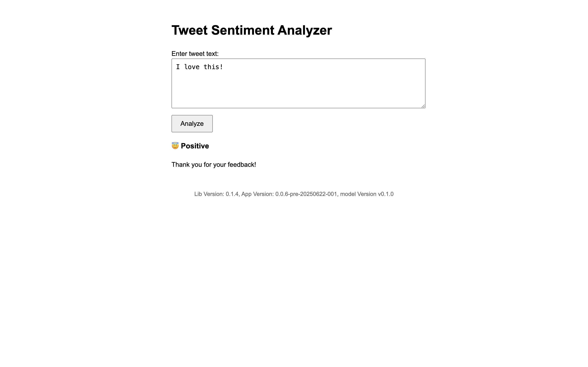
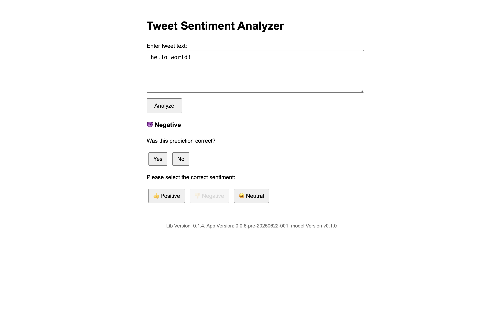
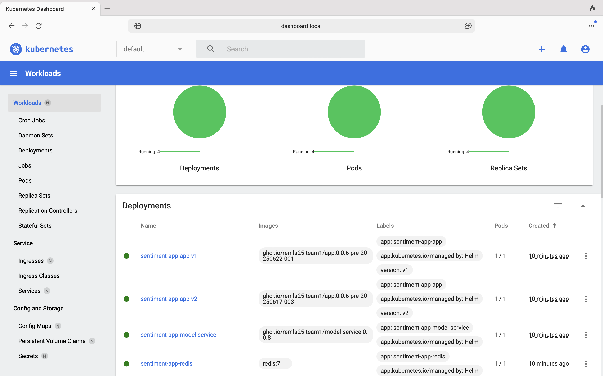

# REMLA-25, Team 1, Operation

This repository defines the **infrastructure and deployment** setup for a modular tweet sentiment analysis system. The system is split across six repositories within the `remla25-team1` GitHub organization:

* **[app](https://github.com/remla25-team1/app)**: Front-end application and API gateway responsible for serving pages and forwarding model inference requests.
* **[model-service](https://github.com/remla25-team1/model-service)**: Microservice for handling sentiment classification requests, interfacing with the preprocessing library and the trained model.
* **[model-training](https://github.com/remla25-team1/model-training)**: Training pipeline to build and export sentiment classification models.
* **[lib-ml](https://github.com/remla25-team1/lib-ml)**: Shared preprocessing library for text cleaning, tokenization, and feature extraction.
* **[lib-version](https://github.com/remla25-team1/lib-version)**: Versioning library to manage and expose the current application version.
* **[operation (this repo)](https://github.com/remla25-team1/operation)**: Orchestration and deployment via Docker, Kubernetes, Helm, Prometheus, Istio, etc.

Each component can be developed, tested, and deployed independently, yet they form a cohesive machine learning-powered web service.

---

## Contents

- [Use-Case](#use-case-tweet-sentiment-analysis)
- [Setup](#setup)
- [Running Application on Kubernetes Cluster](#running-application-on-kubernetes-cluster)
  - [Useful Commands](#useful-commands)
- [Verify Prometheus Setup](#verify-prometheus-setup)
- [Grafana](#grafana)
  - [Auto-load via ConfigMap](#auto-load-via-configmap)
  - [Import the Dashboard Manually](#import-the-dashboard-manually)
- [Testing Istio](#testing-istio)
- [Running the App with Docker Compose](#running-the-app-with-docker-compose)

---

## Use-Case: Tweet Sentiment Analysis

Our application features a simple interface where users can enter a tweet to analyze its sentiment. When submitted, the backend runs a sentiment analysis model and displays the predicted sentiment. The user then sees whether the tweet is positive or negative, and can confirm or correct this prediction. This feedback helps improve the model and makes the app more interactive and accurate over time.

### Example Screenshots

#### 1. Prediction 



#### 2. Correction


---

## Setup Instruction

### 1. Install Required Tools

Before getting started, ensure the following tools are installed on your system:
- [Docker & Docker Compose](https://docs.docker.com/compose/install/)
- [Vagrant](https://developer.hashicorp.com/vagrant/install)
- [Ansible](https://docs.ansible.com/ansible/latest/installation_guide/index.html)
- [Kubectl](https://kubernetes.io/docs/tasks/tools/)
- [Helm](https://helm.sh/docs/intro/install/)
- [yq: command-line YAML processor safer than awk, sed, and grep](https://github.com/mikefarah/yq)

### 2. SSH Key Setup

To securely access services or systems in this project, you need to provide your **public SSH key**. Please follow the steps below to generate your key and add it to the correct location.

#### 1. Generate a new SSH key pair (if you don’t already have one):
```bash
ssh-keygen -t rsa -b 4096 -C "your_email@example.com"
```
- When prompted for a file path, you can press `Enter` to accept the default (`~/.ssh/id_rsa`), or specify a custom name.
- You can also set a passphrase (recommended for security), or leave it blank.

#### 2. Locate your public key:
Your public key will typically be located at:
```bash
~/.ssh/id_rsa.pub
```
or at the custom path you provided.

#### 3. Copy your `.pub` file into the `ssh_keys/` folder of this repository:
```bash
cp ~/.ssh/id_rsa.pub ssh_keys/id_rsa.pub
```

---

### Running Application on Kubernetes Cluster

Navigate into ```operation``` dir and run the commands below:
```bash
chmod +x run-all.sh
./run-all.sh
```


This will set up all services. The script takes a good while to run, so take your time. 

##### PAT token access
During step 3 of the process (indicated in the terminal), you will be asked for your Github username, PAT token, and Github email address. This is so that you can pull the latest images to deploy on the cluster. Set up a `imagePullSecrets` for GHCR: first generate a new token (classic) on Github. Give it scopes `read:packages, repo, org:read`. Copy the token and paste it in the PAT token space. Note: you will need to request access to the organization before you can pull build images like this.

Alternatively, you can use our bot-account to run the cluster. During step 3, use the following credentials:
- Github username: **remla-git-bot**
- Github email: anna.visman@gmail.com (will be swapped for a different email in the future)
- PAT token: **please contact the organization owner to receive this token**

##### BECOME password
Afterwards, you will be asked for your `BECOME` password. This is so that the playbook can run commands in `sudo` mode. Simply fill in your host password here.

At the end of the script, you will be asked to execute the following command, so that you can execute ```kubectl``` commands in the terminal:
```bash
export KUBECONFIG=$(pwd)/kubeconfig-vagrant
echo $KUBECONFIG
# it should output /path/to/project/operation/kubeconfig-vagrant
```

NOTE: for any new shell you spawn, you need to repeat this exporting of the ```KUBECONFIG``` variable.


If you want to upgrade the service to adapt any changes, just rerun

```bash
./run-all.sh
```

When you are finished, tear down the cluster with
```bash
chmod +x cleanup.sh
./cleanup.sh
```

### Accessing the Kubernetes Dashboard

To access the dashboard using the `dashboard.local` domain, you need to map its fixed IP address in your local hosts file.

Add the following line to your `/etc/hosts` file (this requires administrator/sudo privileges):

```
192.168.56.90 dashboard.local
```
*(Note: On macOS or Linux, the file is at `/etc/hosts`. On Windows, it's at `C:\Windows\System32\drivers\etc\hosts`.)*

Navigate to the following URL in your web browser:

[https://dashboard.local](https://dashboard.local)


To log in, you need an authentication token. Run the following command in your terminal (where you have `KUBECONFIG` set up) to generate a token for the `admin-user`:

```bash
kubectl -n kubernetes-dashboard create token admin-user
```
Copy the entire token output from the command above to login.

Then you should see the following dashboard.



#### Useful Commands

These commands can help you debug, manage, and restart your application components more effectively during development or deployment.

- Inspect resources:
```bash
kubectl describe ingress sentiment-app-ingress
kubectl get sentiment-app
kubectl get endpoints sentiment-app
```

- Triger a rollout restart:
```bash
kubectl rollout restart deployment app
kubectl rollout restart deployment model-service
```

- Deleting existing pods manually (only safe if the app is stateless):
```bash
kubectl delete pods --all
kubectl delete pods -l app=app
kubectl delete pods -l app=model-service
``` 

- Inspecting all config maps installed in the cluster:
```bash
kubectl get configmaps
```

- Pushing new Docker image of a repo so that it can be deployed on the running cluster (```app``` example):
```bash
docker build -t ghcr.io/remla25-team1/app:latest .
echo YOUR_TOKEN_HERE | docker login ghcr.io -u YOUR_GITHUB_USERNAME --password-stdin
 # this requires you to have a GHCR token for writing packages (you might want to store it too)
docker push ghcr.io/remla25-team1/app:latest 

# trigger a Deployment restart to pull the new image (ssh into ctrl node!)
kubectl rollout restart deployment app
#deployment.apps/app restarted

# check the rollout status
kubectl rollout status deployment app
# deployment "app" successfully rolled out

# confirm that the new pod is running (below, you can see the age difference)
kubectl get pods -o wide
```

---

### Verify Prometheus Setup

#### 1. Access the Prometheus Web UI
```sh
kubectl port-forward -n monitoring svc/prometheus-kube-prometheus-prometheus 9090:9090
```

Open [http://localhost:9090](http://localhost:9090) in your browser.

To verify that your metrics endpoints are being scraped:

- Go to the Prometheus UI (`Status` → `Targets`)
- Look for your application's Service name or Pod name in the targets list
- Check the status (should be "UP")

#### 2. Test if Metrics Endpoint is Reachable from Inside the Cluster

```sh
kubectl port-forward svc/sentiment-app-app 8080:8080

curl http://localhost:8080/metrics
```

---

### Test Alerting Capabilities 

#### 1. Create a Kubernetes Secret for SMTP Credentials

Use the following command to create a secret containing fake (or real, for production) SMTP credentials.

```bash
kubectl create secret generic alertmanager-smtp-secret \
  --from-literal=smtp_username=fake-user@example.com \
  --from-literal=smtp_password=fake-password \
  -n monitoring
```

#### 2. Re-deploy the Application 

Re-run the deployment to apply changes, including alerting configuration:
```bash
./run-all.sh
```
This ensures that Alertmanager picks up the config and mounts the secret properly.

#### 3. Access Prometheus and Locate the Alert

Forward Prometheus to your local machine:
```sh
kubectl port-forward -n monitoring svc/prometheus-kube-prometheus-prometheus 9090:9090
```

Then open your browser and visit:
[http://localhost:9090](http://localhost:9090)

Look for the custom alert "HighRequestRate" in the list. If it's correctly configured and active, it will appear as Inactive, Pending or Firing.

#### 4. Trigger the Alert by Generating Traffic

To exceed the alert threshold, simulate traffic:
```bash
while true; do curl -s http://192.168.56.91:80/; sleep 0.1; done
```
This generates approximately 10 requests per second, which is well above the threshold.

#### 5. Verify Alert Status

In the Prometheus UI under **Alerts**, verify that the alert transitions from **Pending** to **Firing** after approximately 2m. 

Check the Alertmanager UI to confirm that it received and processed the alert:

```bash
kubectl port-forward -n monitoring svc/alertmanager-operated 9093
```

Then visit: [http://localhost:9093](http://localhost:9093).
You should see the alert listed there.

---

### Grafana 

We provide a pre-configured Grafana dashboard for monitoring. 

#### 1. Accessing Grafana

To access the Grafana interface locally, run the following port-forward command:

```bash
kubectl port-forward svc/prometheus-grafana -n monitoring 3000:80
```

Then, open your browser and visit: [http://localhost:3000](http://localhost:3000)

- **Username:** `admin`
- **Password:** `prom-operator`

#### 2. Exploring the Dashboard

The `sentiment-app` dashboard is automatically provisioned and available. You can find it by navigating to **Dashboards** in the left-hand menu.


#### 3. Dashboard Panels Overview

The dashboard includes several key panels to monitor application health and performance:

- **AB Test:** Compares the average response times between different application versions.
- **Sentiment Response Time:** Displays the average latency for `/sentiment` requests, broken down by data source (`model` or `cache`).
- **User Correction Rate:** Shows the percentage of predictions that users have corrected, with color-coded thresholds indicating model performance.
- **Sentiment Requests In Progress:** A real-time gauge of the number of active `/sentiment` requests.
- **Requests Under Latency Threshold:** Tracks the percentage of requests that meet a configurable performance goal (e.g., completed in under 0.2s).
- **Sentiment Request Volume:** A time-series graph showing the total number of `/sentiment` requests.

For a detailed breakdown of each panel, its purpose, and the underlying Prometheus queries, please see [grafana.md](docs/grafana.md).


---

### Traffic Management
We managed to do a 90/10 routing of 2 kinds of apps.


#### Testing Istio
The cluster is configured with Istio in the ```migrate.yaml``` playbook which you ran above. To test the Istio traffic management functionality, you can try the following two tests:
```bash
# find the INGRES-IP (external ip below)
kubectl -n istio-system get svc istio-ingressgateway
# NAME                   TYPE           CLUSTER-IP     EXTERNAL-IP     PORT(S)                                                                      AGE
# istio-ingressgateway   LoadBalancer   10.98.33.145   192.168.56.91   15021:32752/TCP,80:31897/TCP,443:31145/TCP,31400:30170/TCP,15443:31601/TCP   18m

# testing sticky sessions
for i in {1..10}; do
  curl -s http://<INGRESS_IP>/
  echo
done

curl -H "user-group: canary" http://<INGRESS_IP>/
```

### Additional Use Case for Istio
We implemented local rate limiting, so each individual client can make up to 100 requests per minute. This is to prevent hogging of the network by an individual client. 

### 👉 [Continuous Experiments](docs/continuous-experimentation.md)

### 👉 [Deployment](docs/deployment.md)

### 👉 [Extention Proposal](docs/extension.md)

---

## Running the App with Docker Compose

### 1. Clone All Repositories

You can clone all required repositories for local development with the provided script:
```bash
chmod +x clone-all.sh
./clone-all.sh
```

After cloning, switch to the **operation** repository:
```bash
cd operation
```

Make sure you have SSH access to all repositories (see SSH key setup in ...)

### 2. Run the Application with Docker Compose

From the root of the `operation` repository, build and start all services:
```bash
docker compose up --build
# or
docker-compose up --build
```

### 3. Stop and Clean Up
To stop and remove the containers and associated resources, run the following command:
```bash
docker compose down
# or
docker-compose down
```


