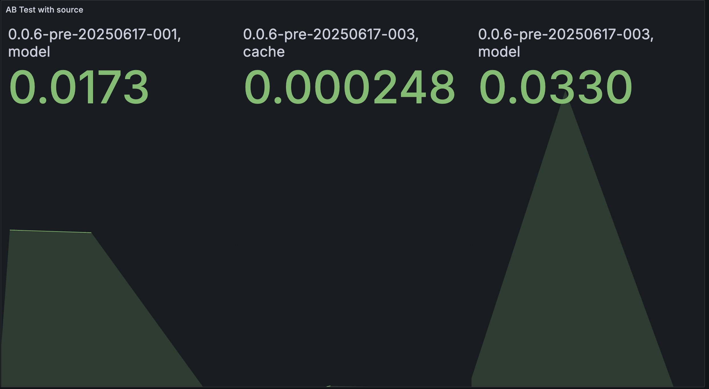
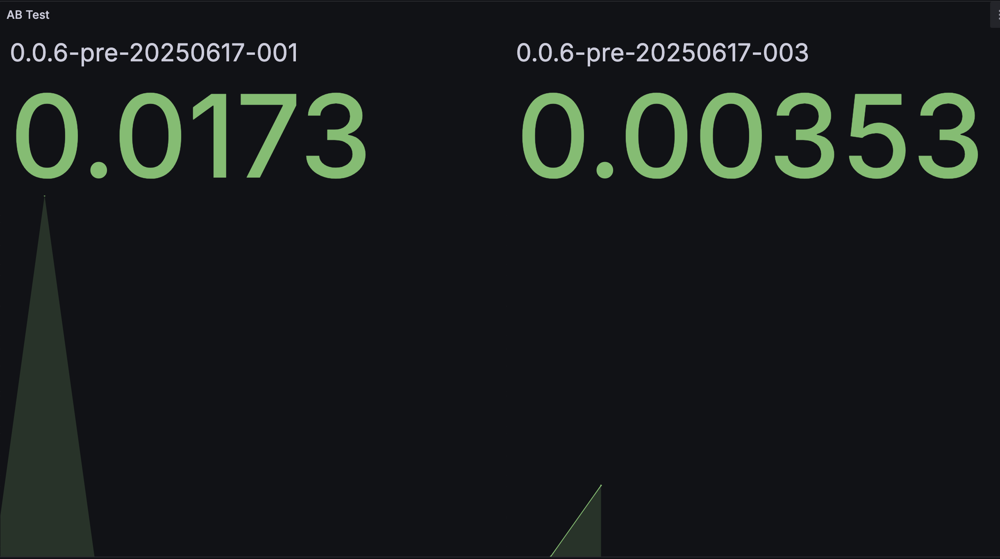

# Continuous Experiment

## Experiment Goal
In `v2 (0.0.6-pre-20250617-003)`, we added a Redis cache layer in front of the model inference logic.

## Hypothesis
We hypothesize that `v2 (0.0.6-pre-20250617-003)` will have a lower average `sentiment_response_time` compared to `v1 (0.0.6-pre-20250617-001)`.

### Experiment Setup
- Both versions are deployed using separate Deployments (v1 and v2).
    - v1: [`ghcr.io/remla25-team1/app:0.0.6-pre-20250617-001`](https://github.com/remla25-team1/app/releases/tag/v0.0.6-pre-20250617-001)
    - v2: [`ghcr.io/remla25-team1/app:0.0.6-pre-20250617-003`](https://github.com/remla25-team1/app/releases/tag/v0.0.6-pre-20250602-003)
- Istio VirtualService routes 90% of traffic to `v1`, and 10% to `v2`.
- Prometheus scrapes app-specific metrics, and Grafana visualizes latency distribution.


## Metrics
The metric used is a histogram, and the average response time is calculated using the standard PromQL formula:
(a)
```
sum by (app_version, source) (
  rate(sentiment_response_time_seconds_sum[$__interval])
)
/
sum by (app_version, source) (
  rate(sentiment_response_time_seconds_count[$__interval])
)
```

(b)
```
#Query A:

sum by (app_version) (
  rate(sentiment_response_time_seconds_sum{app_version="0.0.6-pre-20250617-001"}[$__interval])
)
/
sum by (app_version) (
  rate(sentiment_response_time_seconds_count{app_version="0.0.6-pre-20250617-001"}[$__interval])
)


# Query B:
sum by (app_version) (
  rate(sentiment_response_time_seconds_sum{app_version="0.0.6-pre-20250617-003"}[$__interval])
)
/
sum by (app_version) (
  rate(sentiment_response_time_seconds_count{app_version="0.0.6-pre-20250617-003"}[$__interval])
)

```

They compute the smoothed average latency over time, combining total observed durations and total request counts.

### Result
The screenshot below shows the Prometheus metrics collected during the experiment. 
(a)


(b)


### Observations
App version `0.0.6-pre-20250617-001` uses only model inference and achieves an average response time of `~0.0173s`.

App version `0.0.6-pre-20250617-003` introduces Redis caching, resulting in:

Cache responses: `~0.00025s`

Model responses: `~0.0330s`

Combined average: `~0.00353s`


### Decision
Version `0.0.6-pre-20250617-003` performs significantly better than `0.0.6-pre-20250617-001` in terms of response time.

With caching, most responses in `0.0.6-pre-20250617-003` return almost instantly (`~0.25ms`).

Its overall average response time is much lower than `0.0.6-pre-20250617-001` (`0.0035s` vs. `0.0173s`).

Thus, We choose version `0.0.6-pre-20250617-003` for deployment, as it provides much faster responses.


