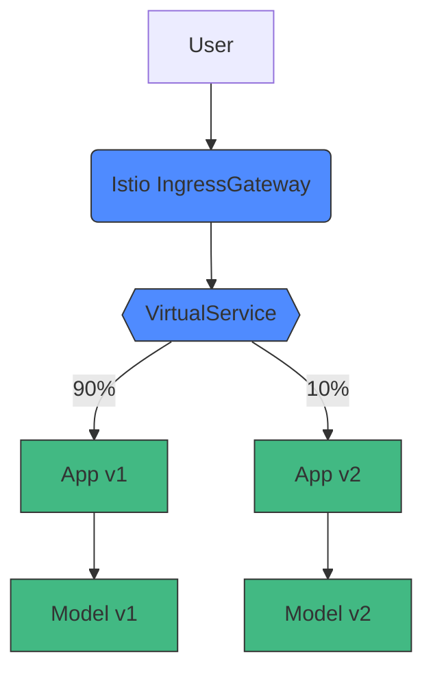
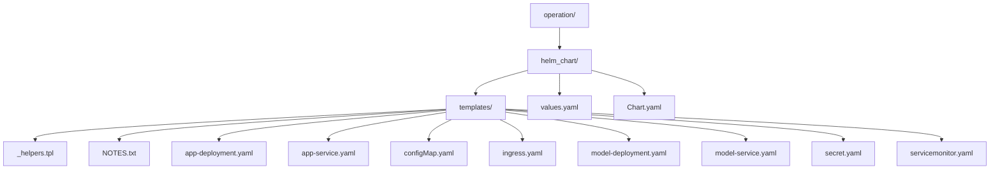
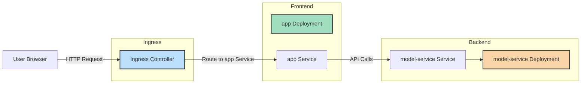
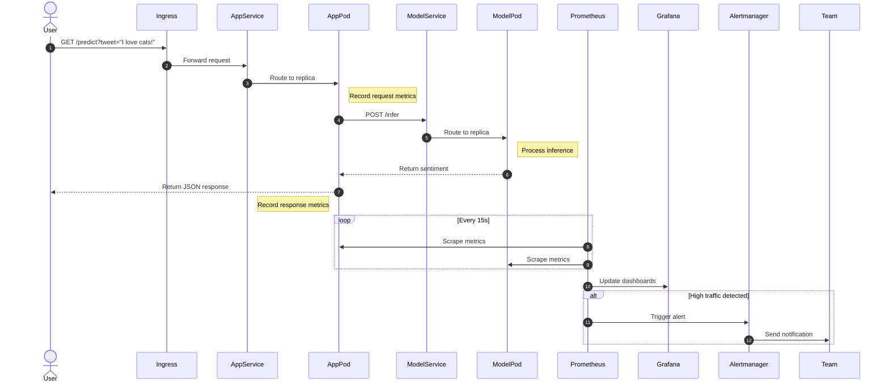

# Deployment Documentation

This document provides a conceptual overview of our final deployment, aimed at enabling new contributors to understand and participate in architectural discussions.

---

### Deployment Tools

The project is deployed using Kubernetes as the orchestrator, Istio as the service mesh, Helm for application packaging and deployment, Promethius for monitoring and Fragana for visualization. Ansible and Vagrant are used to automate and configure the deployment of virtual machines.

---

### High-Level Architecture

Our system compromises two core services: `app` and `model-service`, each deployed on a Kubernetes cluster. Traffic is managed via Istio, and observability is provided by Prometheus and Grafana.

Key supporting components include:

- Helm: Manages deployment definitions and versioning.
- Istio: Handles service-to-service communication, routing, and telemetry.
- Prometheus & Grafana: Collect and visualize metrics.

---

### Conceptual Deployment Structure

Core Services

- Frontend (app)
  Handles external HTTP requests, exposes the /predict endpoint, and delegates inference tasks to the backend.
- Backend (model-service)
  Receives inference requests from the frontend, processes data, and returns sentiment analysis results.

Connectivity

- Services communicate internally via Kubernetes Services.
- External traffic enters through an Istio Ingress Gateway and is routed to internal services using Istio VirtualServices.

---

### Cluster Overview

Our deployment consists of a custom Kubernetes cluster created using kubeadm. The environment is provisioned using Vagrant and configured with Ansible for automation.

The cluster topology:

- 1 Control Node (API server, scheduler, etcd)
- 2 Worker Nodes (Pods scheduled here)

User interface: localhost (webpage)
Control plane (API service, etc.)
Entrypoint: Proxy / LoadBalancer (it is a public IP)
Worker nodes (we have 2 worker nodes and one control node)
Communicates with cluster controller using REST API
We use kubeadm and not minikube

We use Vagrant to create and configure our development environment. We use it to define our controller node, and two worker nodes.
Ansible for automated setup/configuration.
Helm is used as the kubernetes package manager. In other words, we deoloy apps to kubernetes via templates.
Promethius and Grafana is used to monitor and visualize metrics.
Isto for microservice traffic management.

---

### Request & Data Flow

1. User submits a prediction request to `http://app.local/predict?tweet=...`

2. Istio IngressGateway routes the request based on host/path.

3. The frontend service logs the request and forwards data to the backend.

4. The backend service processes inference and returns the result.

5. The frontend logs the response and returns it to the user.

6. Prometheus scrapes both services every 15 seconds for metrics.

7. Grafana visualizes these metrics on live dashboards.

8. Alertmanager notifies the team on abnormal conditions (e.g., high traffic).

---

## Deployment Structure

All deployed resource types and relations.

---

## Dynamic Traffic Routing

- We deploy multiple versions of our frontend and backend services simultaneously:
  - Frontend: `app-service-v1`, `app-service-v2`
  - Backend: `model-service-v1`, `model-service-v2`
- The VirtualService (or Ingress rules) direct traffic dynamically with weights. We use the following split:
  - 90% traffic to `app-service-v1`, 10% to `app-service-v2` (frontend)
  - Similarly for backend services.
- This routing enables canary releases and continuous experimentation by gradually shifting traffic.
- Currently we manually update the weights.

The following visualization illustrates the aforementioned routing strategy:

---

# Old Verison

## Helm Chart Overview

Our Helm chart defines all application and monitoring resources under `helm_chart/templates/`. The structure:

- **app-deployment.yaml**: Defines Deployment for `app` (1 replica, NodePort).
- **app-service.yaml**: Exposes `app` via Service (port 8080).
- **model-deployment.yaml**: Defines Deployment for `model-service` (1 replica).
- **model-service.yaml**: Exposes `model-service` via Service (port 5000).
- **configMap.yaml**: Application configuration (environment variables).
- **secret.yaml**: Docker credentials (GHCR) and SMTP credentials for alerts.
- **ingress.yaml**: Routes `app.local` to Service `app`.
- **servicemonitor.yaml**: Instructs Prometheus to scrape metrics from `app` and `model-service`.

`values.yaml` holds configurable parameters (e.g., image tags, replica counts, ports).  
`Chart.yaml` defines chart metadata.

## Resources Overview

### Helm Chart (helm_chart/templates/)

| File                    | Type            | Description                                                                               |
| ----------------------- | --------------- | ----------------------------------------------------------------------------------------- |
| `_helpers.tpl`          | Helper Template | Contains helper functions (e.g., naming conventions).                                     |
| `NOTES.txt`             | Notes           | Outputs post-install reminders.                                                           |
| `app-deployment.yaml`   | Deployment      | Deploys app containers (1 replica, labeled `{ .Release.Name }}-app`).                     |
| `app-service.yaml`      | Service         | Exposes app pods on port 8080 (NodePort).                                                 |
| `model-deployment.yaml` | Deployment      | Deploys model-service containers (1 replica, labeled `{ .Release.Name }}-app`).           |
| `model-service.yaml`    | Service         | Exposes model-service on port 5000 (ClusterIP).                                           |
| `configMap.yaml`        | ConfigMap       | Defines environment variables: `MODEL_SERVICE_HOST`, `MODEL_SERVICE_PORT`, feature flags. |
| `secret.yaml`           | Secret          | Holds `ghcr-secret` (docker registry) and `smtp-credentials` (alerts).                    |
| `ingress.yaml`          | Ingress         | Routes external traffic for `app.local` → Service `app`.                                  |
| `servicemonitor.yaml`   | ServiceMonitor  | Prometheus scrape configuration for `app` and `model-service`.                            |

### Raw Manifests (k8s/)

| File                      | Type                           | Description                                                 |
| ------------------------- | ------------------------------ | ----------------------------------------------------------- |
| `application-config.yaml` | ConfigMap                      | Mirrors `configMap.yaml` values for direct `kubectl apply`. |
| `app.yaml`                | Deployment + Service + Ingress | Simplified app Deployment, Service, and Ingress (legacy).   |
| `model-service.yaml`      | Deployment + Service           | Simplified model-service Deployment and Service (legacy).   |
| `ingress.yaml`            | Ingress                        | Legacy Ingress for app.                                     |

### Monitoring (Installed via Helm)

| Resource                           | Type               | Description                                                                                 |
| ---------------------------------- | ------------------ | ------------------------------------------------------------------------------------------- |
| ServiceMonitor via Helm Chart      | ServiceMonitor     | Auto-discovered metrics for `app` and `model-service`.                                      |
| PrometheusRule via Helm values     | PrometheusRule     | Defines alert `HighRequestRate` if `rate(sentiment_requests_total[1m]) > 15` for 2 minutes. |
| AlertmanagerConfig via Helm values | AlertmanagerConfig | Routes alerts to SMTP receiver using `smtp-credentials`.                                    |

### Other

| File/Directory       | Type              | Description                                                                                                   |
| -------------------- | ----------------- | ------------------------------------------------------------------------------------------------------------- |
| `join_cluster.sh`    | Script            | Automates joining worker nodes to control plane.                                                              |
| `playbooks/*.yaml`   | Ansible Playbooks | Provision control-plane and worker nodes: disable swap, set sysctls, mount `/mnt/shared`, install Kubernetes. |
| `templates/hosts.j2` | Jinja2 Template   | Generates `/etc/hosts` on each VM with node IPs/hostnames.                                                    |
| `Vagrantfile`        | Vagrant Config    | Spins up 3 VMs: ctrl, k8s-node-1, k8s-node-2.                                                                 |

## Application General Overview

- **Ingress Controller**:  
  Receives `app.local` traffic (LoadBalancer IP `192.168.56.90`) and forwards to the `app` Service.

- **app Service**:  
  Routes traffic to the single `app` Pod running the frontend and API gateway.

- **model-service Service**:  
  Routes traffic to the single `model-service` Pod performing ML inference.

---

## Request Handling Flow

- User sends a request to `http://app.local/predict?tweet="I love cats!"`.

- Ingress Controller (`192.168.56.90`) routes based on host/path → Service **app**.

- **app** pods (1 replica) handle the request:

  - Increment counter `sentiment_requests_total`
  - Start timer for histogram `sentiment_response_time_seconds`
  - Forward inference request to **model-service**

- **model-service** pods (1 replica) process inference:

  - Preprocess input (using `lib-ml`)
  - Increment counter `sentiment_inference_total`
  - Record histogram `sentiment_inference_latency_seconds`
  - Return `{ "sentiment": "positive" }`

- **app** pods record response metrics:

  - Stop timer → record `sentiment_response_time_seconds`
  - Increment counter `sentiment_responses_total{sentiment="positive"}`

- Response is returned to the user’s browser.

---

Every 15 seconds:

- Prometheus scrapes `/metrics` from all **app** and **model-service** pods (via ServiceMonitor).

- Grafana dashboards update with the latest metrics.

---

## Notes on Cluster Resources

- Services expose pods inside the cluster and allow load balancing.
- Ingress exposes services externally with domain-based routing.
- ConfigMaps and Secrets manage configuration and sensitive data.
- ServiceMonitor integrates with Prometheus for monitoring metrics.

---

## Summary

This deployment setup provides a robust, scalable, and flexible infrastructure:

- Clear separation between frontend and backend services.
- Support for versioning and canary deployment strategies.
- Integration with Kubernetes-native resources for easy management.
- Monitoring ready via Prometheus and Grafana dashboards.
