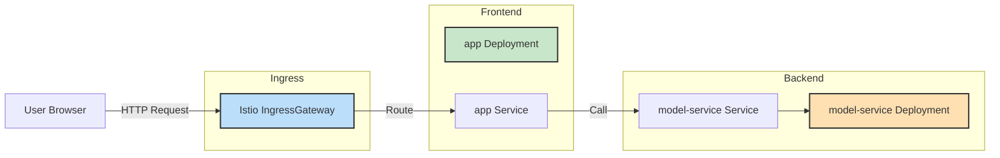
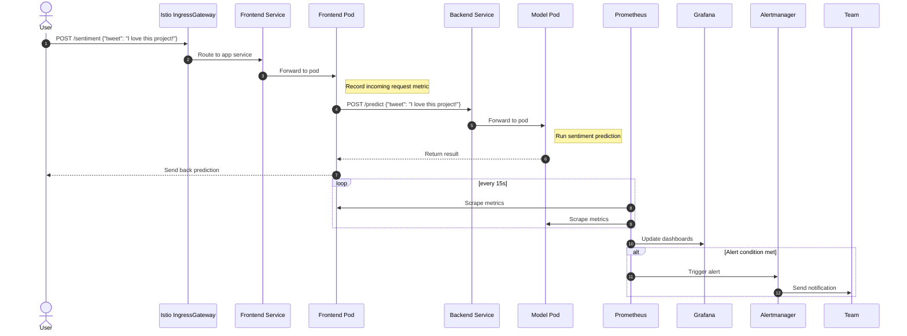
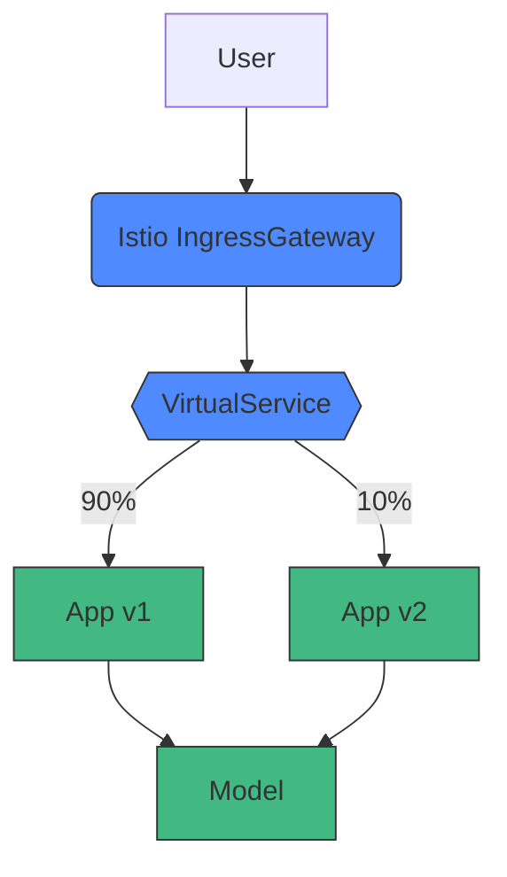

# Deployment Documentation

This document provides a conceptual overview of our final deployment architecture for the tweet sentiment analysis system. It is written to help new contributors understand the system's structure, component interactions, and request flow, so they can participate in design discussions and modifications.

The deployment uses Kubernetes and Istio for orchestration and traffic management, with Prometheus and Grafana for observability. Helm is used to manage configuration and deployment artifacts.

---

## High-Level Architecture

---

## Key Components
- **Frontend (`app`)**: Serves the web interface and exposes a REST API for predictions.
- **Backend (`model-service`)**: Performs sentiment analysis based on incoming JSON data.
- **Istio IngressGateway**: Manages external access and routes traffic to internal services.
- **Helm**: Templates and installs Kubernetes manifests.
- **Prometheus**: Scrapes metrics from services at regular intervals.
- **Grafana**: Provides real-time dashboards for visualizing system performance.

---

## Data Flow

1. **User Request:** A user accesses the app via `POST /sentiment {"tweet": "I love this project!"}`.
2. **Routing via Ingress:** The Istio IngressGateway routes the request to the appropriate frontend service.
3. **Frontend Processing:**
    - The service logs the request and exposes metrics.
    - It forwards the text to the model service for inference.
4. **Model Inference:**
    - The backend model pod processes the tweet and returns the sentiment.
    - The frontend responds to the user and logs the result.
5. **Observability:**
    - **Prometheus** scrapes metrics every 15s from both services.
    - **Grafana** displays the metrics on dashboards.
    - **Alertmanager** triggers notifications (e.g., high request rates).

---

## Dynamic Traffic Routing with Istio

Multiple versions of services are deployed to support controlled experiments:

- We deploy multiple versions of our frontend simultaneously:
  - Frontend: `v1` and `v2`
- The VirtualService (or Ingress rules) direct traffic dynamically with weights. We use the following split:
  - 90% traffic to `v1`, 10% to `v2` (frontend)
- This routing enables canary releases and continuous experimentation by gradually shifting traffic.
- Currently we manually update the weights.

---

## Observability Stack

| Component          | Purpose                                    |
| ------------------ | ------------------------------------------ |
| **Prometheus**     | Scrapes `/metrics` from services           |
| **ServiceMonitor** | Declares which services Prometheus scrapes |
| **Grafana**        | Dashboards for live visualization          |
| **Alertmanager**   | Sends alerts (e.g., on high traffic)       |

Metrics include request counts, latencies, error rates, and custom application metrics.

---

## Design Summary

This deployment setup provides a robust, scalable, and flexible infrastructure:

- Clear service separation and modularity (frontend/backend split).

- Istio for intelligent ingress and service-level traffic management.

- Version-aware deployments support controlled testing strategies.

- Built-in observability with Prometheus + Grafana.

- Alerting via Alertmanager ensures proactive issue handling.