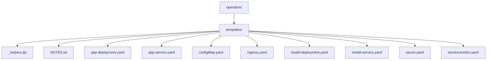
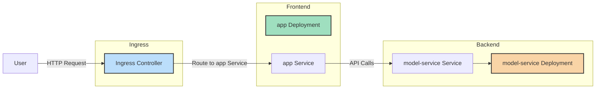

# 📄 Deployment Documentation

## 📦 Helm Chart Overview

The deployment consists of multiple components defined in the Helm Chart:

```mermaid
graph TD
  A[operation/] --> B[templates/]
  B --> B1[_helpers.tpl]
  B --> B2[NOTES.txt]
  B --> B3[app-deployment.yaml]
  B --> B4[app-service.yaml]
  B --> B5[configMap.yaml]
  B --> B6[ingress.yaml]
  B --> B7[model-deployment.yaml]
  B --> B8[model-service.yaml]
  B --> B9[secret.yaml]
  B --> B10[servicemonitor.yaml]
```

## 🧩 Resources Overview

| File                    | Resource Type   | Description                                |
|-------------------------|-----------------|--------------------------------------------|
| `app-deployment.yaml`   | Deployment      | Deploys the main application container     |
| `app-service.yaml`      | Service         | Exposes the application to internal network|
| `model-deployment.yaml` | Deployment      | Deploys ML model(s)                         |
| `model-service.yaml`    | Service         | Exposes model to internal/external clients |
| `configMap.yaml`        | ConfigMap       | Configuration for the application           |
| `secret.yaml`           | Secret          | Manages sensitive credentials               |
| `ingress.yaml`          | Ingress         | Exposes services via HTTP                    |
| `servicemonitor.yaml`   | ServiceMonitor  | Prometheus monitoring configuration         |

## 🌐 Deployment Architecture

```mermaid
graph LR
  subgraph Frontend
    APP[app Deployment]
    APPSVC[app Service]
  end

  subgraph Backend
    MODEL[model-service Deployment]
    MODELSVC[model-service Service]
  end

  subgraph Ingress
    INGRESS[Ingress Controller]
  end

  USER[User]

  USER -->|HTTP Request| INGRESS
  INGRESS -->|Route to app Service| APPSVC
  APPSVC -->|API Calls| MODELSVC
  MODELSVC --> MODEL

  style APP fill:#9fdfbf,stroke:#333,stroke-width:2px
  style MODEL fill:#f9d4a6,stroke:#333,stroke-width:2px
  style INGRESS fill:#bbdefb,stroke:#333,stroke-width:2px
```
## 🔁 Request Handling Flow

1. User sends a request to the application via the Ingress controller (`app.local`)  
2. The Ingress (`192.168.56.90`) routes incoming requests to the `app-service`  
3. The `app-service` pods (3 replicas) handle frontend and API gateway logic:  
   - Increments counter `sentiment_requests_total`  
   - Starts timer for histogram `sentiment_response_time_seconds`  
   - Forwards requests to `model-service`  
4. The `model-service` pods (2 replicas) perform ML inference:  
   - Preprocess input using ML library  
   - Increments counter `sentiment_inference_total`  
   - Records histogram `sentiment_inference_latency_seconds`  
   - Returns sentiment prediction JSON  
5. The `app-service`:  
   - Stops timer and records `sentiment_response_time_seconds`  
   - Increments counter `sentiment_responses_total` (with sentiment label)  
6. Returns final response to user  

---

## 🧩 Visual Data Flow Diagram

```mermaid
sequenceDiagram
    autonumber
    actor User
    participant Ingress
    participant AppService
    participant AppPod
    participant ModelService
    participant ModelPod
    participant Prometheus
    participant Grafana
    participant Alertmanager

    User->>Ingress: GET /predict?tweet="I love cats!"
    Ingress->>AppService: Forward request
    AppService->>AppPod: Route to replica
    
    Note right of AppPod: Metrics:
    1. sentiment_requests_total++
    2. Start response timer

    AppPod->>ModelService: POST /infer {"tweet":"..."}
    ModelService->>ModelPod: Route to replica
    
    Note right of ModelPod: Processing:
    1. sentiment_inference_total++
    2. Record latency

    ModelPod-->>AppPod: {"sentiment":"positive"}
    AppPod-->>User: Return JSON response
    
    Note left of AppPod: Metrics:
    1. sentiment_responses_total++
    2. Record response time

    loop Every 15s
        Prometheus->>AppPod: Scrape /metrics
        Prometheus->>ModelPod: Scrape /metrics
    end

    Prometheus->>Grafana: Update dashboards
    
    alt High traffic detected
        Prometheus->>Alertmanager: Trigger alert
        Alertmanager->>Team: Send notification
    end
```

---

## 🧭 Dynamic Routing and Canary Releases

- We (will) deploy two versions each of the frontend and backend:  
  - Frontend: `app-service-v1`, `app-service-v2`  
  - Backend: `model-service-v1`, `model-service-v2`  
- The VirtualService (or Ingress rules) direct traffic dynamically with weights, for example:  
  - 90% traffic to `app-service-v1`, 10% to `app-service-v2` (frontend)  
  - Similarly for backend services.  
- This routing enables canary releases and continuous experimentation by gradually shifting traffic.

---

## 🔧 Notes on Cluster Resources

- Each Deployment runs multiple replicas (default: 3) to ensure availability.  
- Services expose pods inside the cluster and allow load balancing.  
- Ingress exposes services externally with domain-based routing.  
- ConfigMaps and Secrets manage configuration and sensitive data.  
- ServiceMonitor integrates with Prometheus for monitoring metrics.

---

## 🎯 Summary

This deployment setup provides a robust, scalable, and flexible infrastructure:  

- Clear separation between frontend and backend services.  
- Support for versioning and canary deployment strategies.  
- Integration with Kubernetes-native resources for easy management.  
- Monitoring ready via Prometheus and Grafana dashboards.
