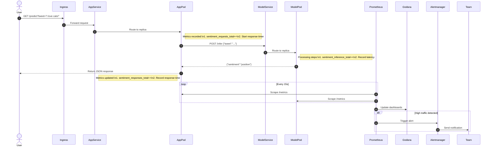

# Deployment Documentation 📦

## 1. System Overview 🚀

This document describes our final Kubernetes deployment of the tweet sentiment analysis system (A3). It covers:

- **Cluster Topology**: Vagrant‐provisioned VMs and node roles  
- **Deployed Resources**: All Kubernetes objects and how they relate  
- **Data Flow**: Request routing, metrics collection, and alerting  
- **Visualizations**: Mermaid diagrams embedded for clarity  

After reading, a new team member should understand how to bring up, inspect, and extend the system.

---

### 1.1 Cluster Topology 🖥️

- **ctrl (192.168.56.100)**  
  - Kubernetes control‐plane (API server, scheduler, controller‐manager)  
  - Hosts the NGINX Ingress Controller Pod (namespace `ingress-nginx`)  
- **k8s-node-1 (192.168.56.101)**  *(labeled `node-role=model`)*  
  - Schedules all `model-service` Pods  
- **k8s-node-2 (192.168.56.102)**  *(labeled `node-role=app`)*  
  - Schedules all `app` Pods  
- **Shared Folder**: All VMs mount `/mnt/shared` via VirtualBox  

Networking:  
- Host‐only network 192.168.56.0/24  
- `/etc/hosts` on the host maps `app.local` → `192.168.56.90` (Ingress LoadBalancer)

---

## 2. Deployed Resources 🏗️

Below is a concise inventory of every Kubernetes object, grouped by category. No YAML details—just concepts and relations.

### 2.1 Namespaces

- `default`:  
  - Hosts `app`, `model-service`, ConfigMaps, Secrets, Ingress  
- `ingress-nginx`:  
  - NGINX Ingress Controller Deployment & Service  
- `monitoring`:  
  - Prometheus, Grafana, Alertmanager, ServiceMonitors, Rules

---

### 2.2 Deployments & Pods

- **app (Deployment)**  
  - **Replicas**: 3 ✔️  
  - **NodeSelector**: `node-role=app`  
  - **Function**: Serves UI & forwards inference requests to `model-service`  
  - **Metrics**: Exposes `/metrics` on port 8080

- **model-service (Deployment)**  
  - **Replicas**: 2 ✔️  
  - **NodeSelector**: `node-role=model`  
  - **Function**: Preprocesses (via `lib-ml`), runs sentiment model, returns JSON  
  - **Metrics**: Exposes `/metrics` on port 5000

- **ingress-nginx-controller (Deployment)**  
  - **Namespace**: `ingress-nginx`  
  - **Function**: Receives external HTTP(S) traffic, forwards to `app` Service

- **prometheus (Deployment)**  
  - **Namespace**: `monitoring`  
  - **Function**: Scrapes metrics from application Pods & cluster components  

- **grafana (Deployment)**  
  - **Namespace**: `monitoring`  
  - **Function**: Visualizes metrics with custom dashboards  

- **alertmanager (Deployment)**  
  - **Namespace**: `monitoring`  
  - **Function**: Sends email alerts when Prometheus rules trigger  

---

### 2.3 Services 🌐

- **Service `app`**  
  - **Type**: NodePort (external access on each node)  
  - **Port**: 8080 → NodePort 32045  
  - **Selector**: `app=app` → balances among 3 `app` Pods  

- **Service `model-service`**  
  - **Type**: ClusterIP (internal)  
  - **Port**: 5000  
  - **Selector**: `app=model-service` → routes to 2 `model-service` Pods  

- **Service `ingress-nginx-controller`**  
  - **Namespace**: `ingress-nginx`  
  - **Type**: LoadBalancer → External IP 192.168.56.90  
  - **Ports**: 80, 443 → routes to Ingress Pods  

- **Service `prometheus`**  
  - **Namespace**: `monitoring`  
  - **Type**: ClusterIP 9090 → Prometheus UI/API  

- **Service `grafana`**  
  - **Namespace**: `monitoring`  
  - **Type**: ClusterIP 80 → Grafana UI (forward via `kubectl port-forward`)  

---

### 2.4 Ingress & Routing 🛣️

- **Ingress resource `app-ingress`** (namespace `default`)  
  - **Host**: `app.local`  
  - **Path `/`** → forwards to Service `app` (port 8080)  
  - **Annotation**: `nginx.ingress.kubernetes.io/rewrite-target: /`  

- **DNS / Hosts**:  
  - On host machine, add  
    ```
    192.168.56.90   app.local
    ```

---

### 2.5 ConfigMaps & Secrets 🔑

- **ConfigMap `application-config`** (namespace `default`)  
  - Provides environment variables to `app` Pods:  
    - `MODEL_SERVICE_HOST="model-service"`  
    - `MODEL_SERVICE_PORT="5000"`  
    - Any feature flags (e.g., `ENABLE_FEEDBACK="true"`)

- **Secret `ghcr-secret`** (namespace `default`)  
  - Docker registry credentials to pull images from `ghcr.io/remla25-team1`  

- **Secret `smtp-credentials`** (namespace `monitoring`)  
  - Contains base64-encoded SMTP username/password for Alertmanager email alerts  

---

### 2.6 Monitoring CRDs 📈

- **ServiceMonitor `app-servicemonitor`**  
  - **Selector**: `app=app`  
  - **Endpoint**: `/metrics` (port 8080), interval 15s  

- **ServiceMonitor `model-servicemonitor`**  
  - **Selector**: `app=model-service`  
  - **Endpoint**: `/metrics` (port 5000), interval 15s  

- **PrometheusRule `prometheusrule-app`**  
  - **Alert**: `HighRequestRate` → when `rate(sentiment_requests_total[1m]) > 15` for 2m  
  - Sends severity `warning`

- **AlertmanagerConfig `alertmanagerconfig-smtp`**  
  - **Route**: all alerts → `smtp-receiver`  
  - **Receiver**: `smtp-receiver` sends email using `smtp-credentials` to `dev-team@example.com`  

---

## 3. Data Flow & Dynamic Routing 🔄

Below is a sequence diagram illustrating how a tweet inference request moves through the system:


```mermaid
sequenceDiagram
    autonumber
    actor User
    participant Ingress
    participant AppService
    participant AppPod
    participant ModelService
    participant ModelPod
    participant Prometheus
    participant Grafana
    participant Alertmanager

    User->>Ingress: GET /predict?tweet="I love cats!"
    Ingress->>AppService: Forward request
    AppService->>AppPod: Route to replica
    
    Note right of AppPod: Metrics recorded:\n1. sentiment_requests_total++\n2. Start response timer

    AppPod->>ModelService: POST /infer {"tweet":"..."}
    ModelService->>ModelPod: Route to replica
    
    Note right of ModelPod: Processing steps:\n1. sentiment_inference_total++\n2. Record latency

    ModelPod-->>AppPod: {"sentiment":"positive"}
    AppPod-->>User: Return JSON response
    
    Note left of AppPod: Metrics updated:\n1. sentiment_responses_total++\n2. Record response time

    loop Every 15s
        Prometheus->>AppPod: Scrape /metrics
        Prometheus->>ModelPod: Scrape /metrics
    end

    Prometheus->>Grafana: Update dashboards
    
    alt High traffic detected
        Prometheus->>Alertmanager: Trigger alert
        Alertmanager->>Team: Send notification
    end
```