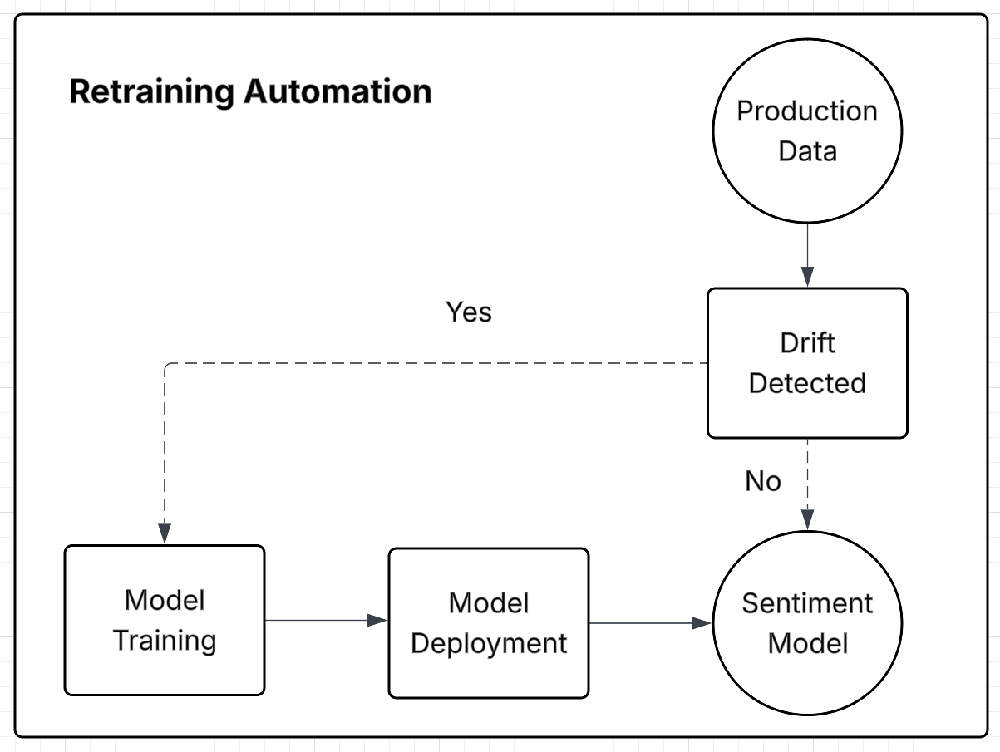

# Extension Proposal

### Identified Shortcoming

Our project implements a robust release engineering pipeline using GitHub workflows and Helm. It includes containerized services, automated testing, and controlled deployments with support for canary rollouts via Istio. These capabilities enable us to gradually release new versions and monitor their live performance using Prometheus and Grafana. We also employ DVC (Data Version Control) to manage the training pipeline. This ensures that models, metrics, and datasets are versioned and reproducible across retraining runs. 

However, despite this strong foundation, the retraining and redeployment of our ML model remains disconnected from production feedback. Retraining is manually triggered and does not react to data drift, performance degradation, or new data availability.

This creates two major risks:
- **Underfitting to changing user behavior**: If the model experiences concept drift or distribution shift, performance may silently degrade. For example, our system analyzes sentiment in tweets, and public sentiment on certain topics can evolve over time. A tweet pattern that was previously associated with positive sentiment may, in the future, indicate negativity [^neptune]. This type of shift causes the model to misclassify updated language and sentiment, leading to reduced accuracy unless retrained with fresh data.
- **Wasted compute from unnecessary retraining**: Manual or scheduled retraining may occur even when no significant data change has occurred.

In either case, our release pipeline does not currently adapt to real-time production dynamics, which limits long-term model reliability and responsiveness.

As highlighted in [^medium], incorporating deployment triggers is considered a best practice in ML pipeline automation. Retraining and redeployment should be automatically initiated based on real-time monitoring metrics. This extension improves both the training and release pipelines:
- In the **training pipeline**, it enables data-driven retraining that adapts to user behavior over time.
- In the **release pipeline**, it ensures that validated models are automatically packaged and deployed, improving responsiveness and reducing manual overhead.

### Proposed Extension: Data-Triggered Retraining and Redeployment

We propose extending the release pipeline with a **trigger-based mechanism** that initiates retraining and deployment when production data indicates model degradation or significant drift.

**Key Components**
- **Concept Drift Detection**
    - Monitor key production features and prediction confidence using Prometheus.
    - Detect drift using metrics such as Population Stability Index (PSI) or KL divergence, computed by scheduled jobs.
- **Triggering Mechanism**
    - Automatically trigger retraining via GitHub workflows when drift exceeds a defined threshold.
    - Optionally trigger based on volume thresholds (e.g., “X% new data accumulated”).
- **Automated Retraining**
    - Rerun the DVC-managed training pipeline using the new data (`dvc repro`).
    - Save and version the resulting model, metrics, and artifacts.
- **CI/CD Redeployment**
    - Automatically package and release the new model version using GitHub workflows.
    - Deploy to Kubernetes via Helm. Best practice is to do it as a canary release for validation before full rollout.

### Visual Overview

### Experimental Evaluation

To evaluate the effectiveness of this extension, we propose the following setup:
- **Hypothesis**: “Data-triggered retraining reduces performance degradation and eliminates unnecessary retraining.”
- **Methodology**:
    - Implement two pipelines: one with periodic retraining (e.g., weekly), the other using data-driven triggers.
    - Simulate drift using synthetic input data.
    - Measure and compare:
        - The latency between when model drift actually begins (i.e., when the input data or user behavior changes) and when the system detects it and starts retraining.
        - How much the model's predictive performance worsened before the retraining kicked in
        - How often the pipeline retrains the model, and how much compute/storage it uses.
- **Evaluation Criteria**:
    - The pipeline that achieves faster detection and response to drift, with less accuracy degradation and fewer unnecessary retraining cycles, will be considered more effective.
    - If both pipelines perform similarly in accuracy, the one with lower compute cost will be favored.

### Sources

[^medium]: [Best Practices for Deploying Machine Learning Models in Production](https://medium.com/@nemagan/best-practices-for-deploying-machine-learning-models-in-production-10b690503e6d)

[^neptune]: [Retraining Model During Deployment](https://neptune.ai/blog/retraining-model-during-deployment-continuous-training-continuous-testing)