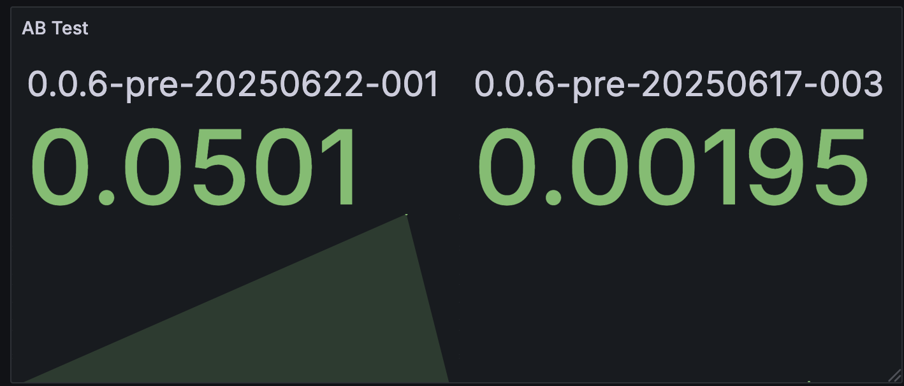
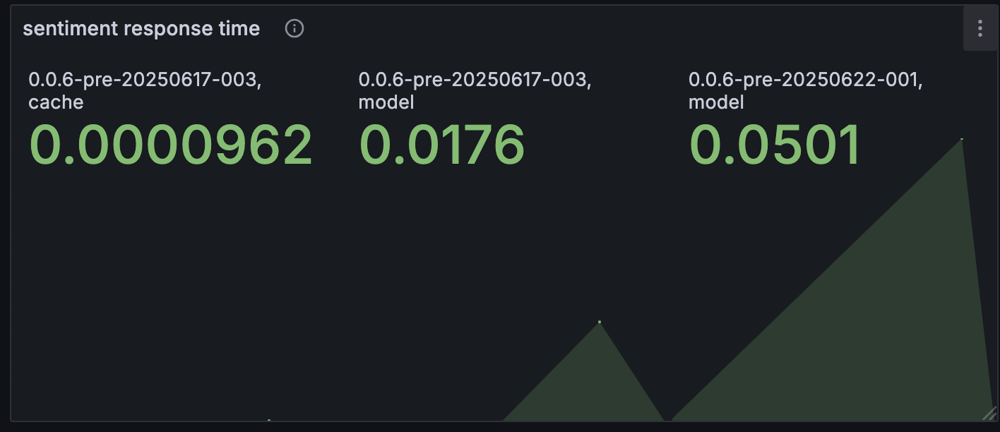
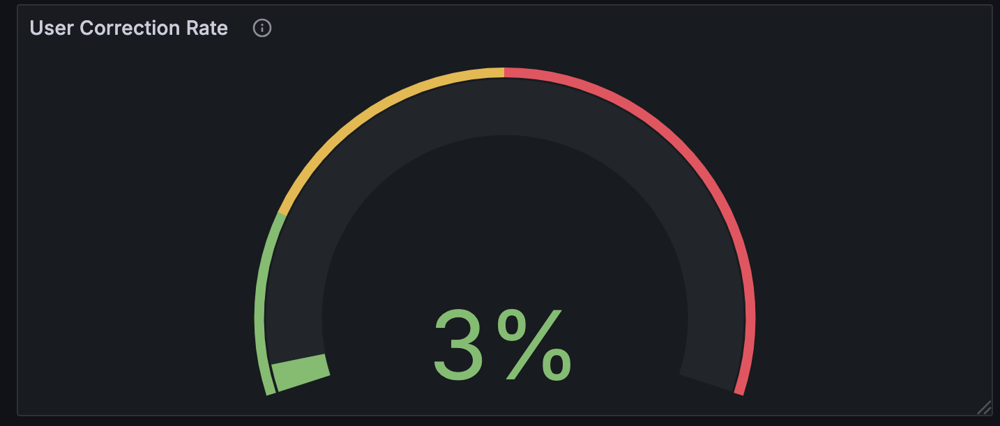
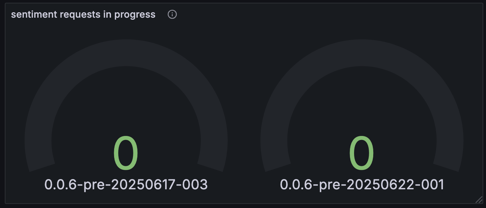
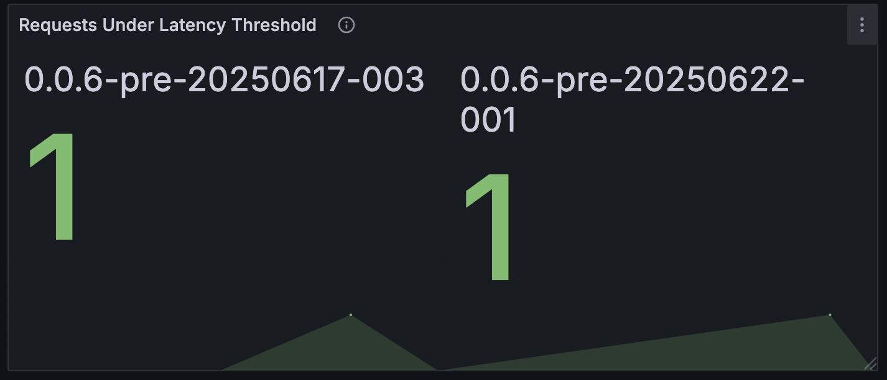
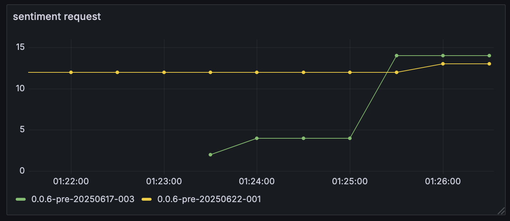

# Grafana Dashboard

This Grafana dashboard provides real-time monitoring and A/B testing insights for the **Tweet sentiment Application**, based on Prometheus metrics from the model and cache services.

--- 
### Accessing the Dashboard
To access the Grafana interface locally, run:

```bash
kubectl port-forward svc/prometheus-grafana -n monitoring 3000:80
```
Then open your browser and visit: http://localhost:3000

In http://localhost:3000/dashboards, there is a dashboard called `sentiment-app`.

---

### Panels Description

### 1. **AB Test**

- **Type:** Stat
- **Description:**  
  Compares average response times between two app versions using Prometheus histogram metrics.
- **Query Logic (Metrics):**  
```
avg_response_time = rate(sum)/rate(count)
```

---

### 2. **Sentiment Response Time**

- **Type:** Stat
- **Grouped By:** `app_version`, `source` (`model` or `cache`)
- **Description:**  
Displays the average response time of `/sentiment` endpoint, separated by data source.  
- `model`: Inference performed by ML model  
- `cache`: Retrieved from Redis

---
### 3. **User Correction Rate**

- **Type:** Gauge
- **Description:**  
Shows the rate of corrections submitted by users via the `/correction` endpoint.
- **Calculation:**  
``` correction_requests_total / sentiment_requests_total ``` 

- **Thresholds:**
- Green: `< 20%` (acceptable)
- Yellow: `20%–50%` (needs attention)
- Red: `> 50%` (risky)
---

### 4. **Sentiment Requests In Progress**

- **Type:** Gauge
- **Description:**  
Displays the number of in-progress `/sentiment` requests at scrape time.
- **Note:**  
This is a snapshot metric; values are often `0` unless:
- Prometheus scrape interval is `≤ 2s`  
- Multiple requests are in progress concurrently
---
### 5. **Requests Under Latency Threshold**

- **Type:** Stat
- **Description:**  
Shows percentage of requests completed under a configurable latency threshold (e.g., 0.1s).
- **Configurable Variable:** `$le_threshold`
- **Calculation:**  
- **Configurable Variable:** `$le_threshold`

| Threshold Option | Meaning                            |
|------------------|-------------------------------------|
| `0.1` (default)  | Very strict latency goal (100ms)    |
| `0.2`, `0.3`     | Moderate latency threshold          |
| `0.5`, `1.0`     | High-latency tolerance              |
| `2.0`            | Loosest threshold (2s max)          |

Use the dropdown at the top of the dashboard to change `$le_threshold`.


---

### 6. **Sentiment Request Volume**

- **Type:** Timeseries
- **Description:**  
Count number of `/sentiment` requests grouped by `app_version`.

